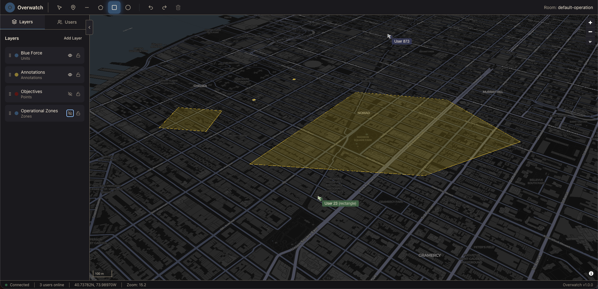
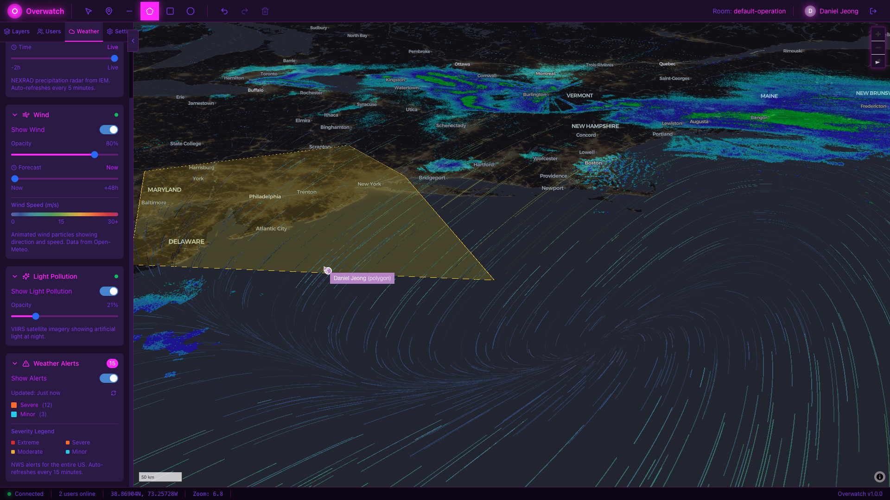

# Overwatch

**Built by Daniel Jeong**

**Live Demo:** https://overwatch.danielyj.com

Login with:
> Email: test2@overwatch.danielyj.com  
> Password: testtest

A real-time collaborative Common Operational Picture (COP) platform. Think of it as "Google Docs for maps" — when one operative draws, marks, or annotates the map, every connected user sees the change instantly.




## Features

- ✨ Real-time collaborative drawing and annotation (CRDT-based, conflict-free)
- 🗺️ High-performance vector tile rendering for large-scale deployments
- 📍 Multi-layer operational overlays (units, routes, zones, threats)
- 🔄 Offline-first architecture with sync-on-reconnect
- 🔐 Role-based access control with admin approval system
- 👥 Admin dashboard for user management
- 🎨 Modern, futuristic UI design

## Technology Stack

### Frontend
- **MapLibre GL JS** - Core map rendering (WebGL-based)
- **Deck.gl** - High-performance data visualization layers
- **Yjs** - CRDT library for real-time collaboration
- **React 19** - UI framework
- **Vite 6** - Build tooling

### Backend
- **Hocuspocus** - Yjs WebSocket server with persistence
- **Martin** - Rust-based vector tile server
- **PostgreSQL 16 + PostGIS** - Spatial database
- **Redis 7** - Pub/sub and caching
- **Caddy** - Reverse proxy with automatic HTTPS

## Prerequisites

- Docker and Docker Compose
- Node.js 20+ (for local development)
- npm or pnpm

## Quick Start (Local Development)

### 1. Clone and setup

```bash
git clone https://github.com/danielyj147/overwatch.git
cd overwatch
cp .env.example .env
```

### 2. Generate secrets

```bash
# Database password
openssl rand -base64 32

# JWT secret
openssl rand -base64 32

# Admin registration secret
openssl rand -base64 32
```

Update `.env` with the generated values.

### 3. Start all services

```bash
docker-compose up -d
```

Wait for services to be healthy:

```bash
docker-compose ps
```

### 4. Run database migrations

```bash
for migration in db/migrations/*.sql; do
    docker-compose exec -T postgres psql -U overwatch -d overwatch < "$migration"
done
```

### 5. Start frontend development server

```bash
cd client
npm install
npm run dev
```

The application will be available at `http://localhost:5173`.

### 6. Register admin account

1. Open http://localhost:5173
2. Click "Register as Admin"
3. Enter your admin secret from `.env` file
4. Create your account

## Production Deployment

### AWS Deployment with Terraform

Deploy to AWS EC2 with automatic SSL, monitoring, and CI/CD for **~$10-12/month** (or **~$3-5 with AWS free tier**).

**Complete guide:** [AWS_DEPLOYMENT.md](./AWS_DEPLOYMENT.md)

#### Quick Deploy (5 Steps)

```bash
# 1. Configure Terraform
cd terraform
cp terraform.tfvars.example terraform.tfvars
nano terraform.tfvars  # Add your domain, secrets, SSH key

# 2. Apply infrastructure
terraform init
terraform apply

# 3. Get EC2 IP
terraform output instance_public_ip

# 4. Build and deploy
cd ../client
npm ci && npm run build
scp -r dist ubuntu@<EC2_IP>:/home/ubuntu/overwatch/client/

# 5. SSH to EC2 and start services
ssh -i ~/.ssh/overwatch-ec2 ubuntu@<EC2_IP>
cd /home/ubuntu/overwatch
docker-compose -f docker-compose.aws.yml up -d
```

**Features**:
- ✅ Automatic HTTPS with Let's Encrypt
- ✅ Cloudflare DNS integration
- ✅ Automated backups
- ✅ Health monitoring
- ✅ GitHub Actions CI/CD
- ✅ Production-ready configuration

**Architecture**: Single EC2 instance (t3.micro) running Caddy, Client, Hocuspocus, Martin, PostgreSQL, and Redis in Docker containers.

### GitHub Actions (Automated Deployment)

Set up automatic deployment on every push to master:

#### 1. Add GitHub Secrets

Go to **GitHub → Repository → Settings → Secrets and variables → Actions**

Add these secrets:

| Secret Name | Value | How to get |
|-------------|-------|------------|
| `EC2_HOST` | Your EC2 public IP | `cd terraform && terraform output instance_public_ip` |
| `EC2_SSH_KEY` | SSH private key | `cat ~/.ssh/overwatch-ec2` (entire file) |
| `DOMAIN_NAME` | Your domain | Example: `overwatch.danielyj.com` |

#### 2. Push to master

```bash
git add .
git commit -m "feat: your changes"
git push origin master
```

GitHub Actions will automatically:
1. Build frontend with production config
2. Deploy to EC2 via SSH
3. Restart services
4. Run database migrations
5. Verify deployment

Watch progress at **GitHub → Actions** tab.

**Deployment Documentation:**
- [GitHub Actions Setup](./.github/workflows/README.md) - Workflow details
- [Deployment Secrets](./.github/DEPLOYMENT_SECRETS.md) - Quick reference

## Admin System

### User Flows

**Admin Registration:**
1. Click "Register as Admin" on login screen
2. Enter credentials + admin secret key (from `.env`)
3. Immediately logged in → Admin Dashboard

**User Registration:**
1. Sign up with email/password
2. See "Please wait for admin approval" message
3. Cannot log in until approved

**Admin Approval:**
1. Admin sees pending users in dashboard
2. Reviews and approves/rejects
3. Approved users can immediately log in

## API Endpoints

| Endpoint | Method | Auth | Description |
|----------|--------|------|-------------|
| `/api/auth/admin/register` | POST | Admin Secret | Register admin |
| `/api/auth/signup` | POST | None | Register user (pending) |
| `/api/auth/login` | POST | None | Login (approved users only) |
| `/api/auth/verify` | POST | JWT | Verify token |
| `/api/auth/admin/pending-users` | GET | Admin JWT | List pending users |
| `/api/auth/admin/users` | GET | Admin JWT | List all users |
| `/api/auth/admin/approve/:userId` | POST | Admin JWT | Approve user |
| `/api/auth/admin/reject/:userId` | POST | Admin JWT | Reject user |
| `/ws` | WebSocket | JWT | Real-time collaboration |
| `/tiles/*` | GET | None | Vector map tiles |

## Environment Variables

### Required for Production

| Variable | Description | Generate with |
|----------|-------------|---------------|
| `DATABASE_URL` | PostgreSQL connection string | Constructed from other vars |
| `POSTGRES_USER` | Database user | `overwatch` |
| `POSTGRES_PASSWORD` | Database password | `openssl rand -base64 32 \| tr -d '/+='` |
| `POSTGRES_DB` | Database name | `overwatch` |
| `HOCUSPOCUS_SECRET` | JWT signing secret | `openssl rand -base64 32` |
| `ADMIN_REGISTRATION_SECRET` | Admin registration key | `openssl rand -base64 32` |
| `DOMAIN_NAME` | Your domain | `overwatch.example.com` |

### Frontend Build Variables

| Variable | Description | Example |
|----------|-------------|---------|
| `VITE_MAP_STYLE_URL` | Martin style endpoint | `https://your-domain.com/tiles/style.json` |
| `VITE_HOCUSPOCUS_URL` | WebSocket endpoint | `wss://your-domain.com/ws` |
| `VITE_API_URL` | API base URL | `https://your-domain.com` |
| `VITE_MARTIN_URL` | Vector tiles base | `https://your-domain.com/tiles` |

## Project Structure

```
overwatch/
├── client/                    # React frontend
│   ├── src/
│   │   ├── components/        # UI components
│   │   ├── stores/           # Zustand state management
│   │   ├── lib/              # Yjs, map utilities
│   │   └── types/            # TypeScript definitions
│   └── dist/                 # Production build
├── server/
│   └── hocuspocus/           # Collaboration server
│       ├── src/
│       │   ├── routes/       # Auth endpoints
│       │   ├── extensions/   # Postgres, Auth
│       │   └── hooks/        # Document lifecycle
│       └── Dockerfile
├── martin/                   # Vector tile config
├── db/
│   └── migrations/           # Database schema
├── terraform/                # AWS infrastructure
├── .github/
│   └── workflows/            # CI/CD pipelines
└── scripts/                  # Deployment scripts
```

## Development

### Running Services Individually

```bash
# Database only
docker-compose up -d postgres

# Vector tiles
docker-compose up -d martin

# Collaboration server
docker-compose up -d hocuspocus

# View logs
docker-compose logs -f hocuspocus

# Check service status
docker-compose ps
```

### Database Migrations

Create a new migration:

```bash
# Create file: db/migrations/007_your_migration.sql
# Then run:
docker-compose exec postgres psql -U overwatch -d overwatch -f /path/to/migration.sql
```

Or run all migrations:

```bash
for migration in db/migrations/*.sql; do
    docker-compose exec -T postgres psql -U overwatch -d overwatch < "$migration"
done
```

### Useful Commands

```bash
# View all service logs
docker-compose logs -f

# Restart a specific service
docker-compose restart hocuspocus

# Rebuild after code changes
docker-compose up -d --build hocuspocus

# Check database
docker-compose exec postgres psql -U overwatch -d overwatch

# Check Redis
docker-compose exec redis redis-cli

# Monitor resource usage
docker stats
```

## Troubleshooting

### Frontend build fails with out of memory

Build on your local machine instead:
```bash
cd client
npm ci && npm run build
scp -r dist ubuntu@<EC2_IP>:/home/ubuntu/overwatch/client/
```

### Admin registration returns 403 Forbidden

Check admin secret matches:
```bash
# On EC2
docker-compose -f docker-compose.aws.yml exec hocuspocus printenv | grep ADMIN_REGISTRATION_SECRET
cat .env | grep ADMIN_REGISTRATION_SECRET
```

### Services show as unhealthy

Check logs:
```bash
docker-compose logs <service-name>
```

### Database connection errors

Verify DATABASE_URL format (special characters must be URL-encoded):
```bash
# / must be encoded as %2F
# Example: password/123 → password%2F123
```

## Documentation

- [AWS Deployment Guide](./AWS_DEPLOYMENT.md) - Complete AWS setup
- [Architecture Details](./CLAUDE.md) - Technical deep dive
- [GitHub Actions](/.github/workflows/README.md) - CI/CD setup
- [Deployment Secrets](./DEPLOYMENT_SECRETS.csv) - Your credentials (gitignored)

## Security Notes

1. **Never commit secrets** - Keep `.env`, `terraform.tfvars`, and `DEPLOYMENT_SECRETS.csv` in `.gitignore`
2. **Use strong passwords** - Generate with `openssl rand -base64 32`
3. **Restrict SSH** - Configure EC2 security group for your IP only
4. **Rotate credentials** - Change secrets periodically
5. **Monitor access** - Check logs regularly: `docker-compose logs -f`

## License

MIT

## Author

**Daniel Jeong**

A production-ready real-time collaborative mapping platform for operational awareness and coordination.

---

**Source Code:** https://github.com/danielyj147/overwatch
